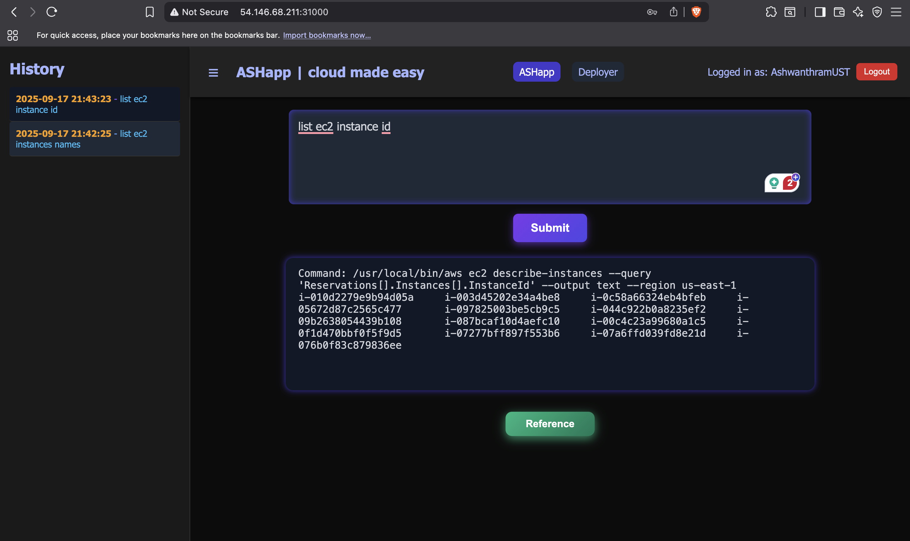

# Project Working Screenshots

Here are some working screenshots of the project:

## Screenshots

### Screenshot 1



## Overview

**HISTORY-SERVICE-MICROSERVICE** is a Spring Boot-based microservice designed to record, store, and retrieve the history of queries and their outputs. It is built with Java 17, uses H2 as an embedded database, and is containerized for deployment in Kubernetes environments. The service is intended to be a reusable backend component for applications that need to track and audit user or system actions.

---

## Features

- **RESTful API** for saving and listing history records.
- **Persistent storage** using H2 database.
- **Time zone configuration** for consistent timestamping.
- **Kubernetes-ready** with deployment, service, HPA, and RBAC manifests.
- **CI/CD** pipelines for automated build, test, security scan, and deployment.

---

## High-Level Workflow

1. **Client Application** sends a request to save or retrieve history.
2. **History Service API** receives the request via REST endpoints.
3. **Service Layer** processes the request and interacts with the database.
4. **Database** stores or retrieves the history data.
5. **Response** is sent back to the client.

---

## UML Diagram (Class & Sequence)

### Class Diagram

```
+---------------------+
|   History           |
+---------------------+
| - id: Long          |
| - query: String     |
| - output: String    |
| - timestamp: Date   |
+---------------------+

+---------------------+
|   HistoryRepository |
+---------------------+
| + findAllByOrderByIdDesc() |
+---------------------+

+---------------------+
|   HistoryController |
+---------------------+
| + saveHistory()     |
| + listHistory()     |
+---------------------+
```

### Sequence Diagram

```
Client --> HistoryController: POST /history/save (query, output)
HistoryController --> HistoryRepository: save(history)
HistoryRepository --> Database: INSERT history
Database --> HistoryRepository: Success
HistoryRepository --> HistoryController: Saved entity
HistoryController --> Client: Response (saved history)

Client --> HistoryController: GET /history/list
HistoryController --> HistoryRepository: findAllByOrderByIdDesc()
HistoryRepository --> Database: SELECT * FROM history ORDER BY id DESC
Database --> HistoryRepository: List<History>
HistoryRepository --> HistoryController: List<History>
HistoryController --> Client: Response (history list)
```

---

## Design Diagram (Component/Deployment)

```
+-------------------+        +---------------------+        +------------------+
|   Client App      | <----> |  History Service    | <----> |   H2 Database    |
| (Frontend/Other)  |  REST  | (Spring Boot, REST) |  JPA   | (Embedded)       |
+-------------------+        +---------------------+        +------------------+
                                   |
                                   v
                            +------------------+
                            | Kubernetes       |
                            | (Deployment,     |
                            |  Service, HPA,   |
                            |  RBAC)           |
                            +------------------+
```

---

## API Endpoints

### 1. Save History

- **Endpoint:** `POST /history/save`
- **Request Body:** `{ "query": "...", "output": "..." }`
- **Response:** Saved history record (with timestamp and ID)
- **Error Handling:** Returns 400 for missing fields, 500 for server errors.

### 2. List History

- **Endpoint:** `GET /history/list`
- **Response:** List of all history records, ordered by most recent.

---

## Kubernetes Workflow

- **Deployment:** Deploys the service as a single replica (scalable via HPA).
- **Service:** Exposes the service internally via ClusterIP.
- **HPA:** Configured for CPU-based auto-scaling.
- **RBAC:** Restricts service account permissions to only what is needed.
- **CI/CD:** GitHub Actions automate build, test, security scan, Docker image push, and Kubernetes deployment.

---

## How It Works (Public Explanation)

This microservice acts as a simple, auditable log for any application that needs to track what queries were made and what outputs were returned. It exposes a REST API for saving and retrieving these records. The service is designed for cloud-native environments, with all necessary Kubernetes manifests and CI/CD automation included. It is suitable for use as a backend component in larger systems, or as a standalone service for audit and history tracking.

---

## Extending & Integrating

- **Integrate** with any frontend or backend via HTTP REST.
- **Deploy** in any Kubernetes cluster.
- **Customize** for other databases or additional endpoints as needed.

---

## Diagram Rendering

You can render the above diagrams using tools like [PlantUML](https://plantuml.com/) or [Mermaid](https://mermaid-js.github.io/).

---

For more details, see the Kubernetes manifests in `backend/k8s/` and the Java source in `backend/history-services/src/main/java/com/example/historyservice/`.

---


